# Architecture — Airia Sentinel

Technical deep dive into the multi-agent orchestration system.

---

## System Overview

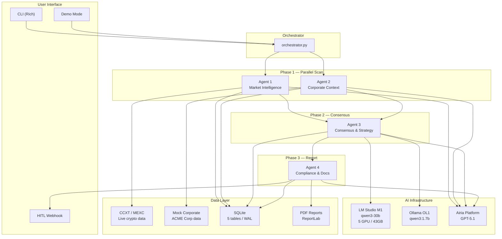

---

## Pipeline Execution Flow

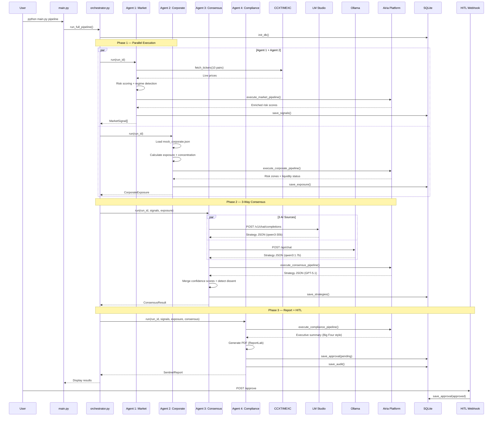

---

## Data Models

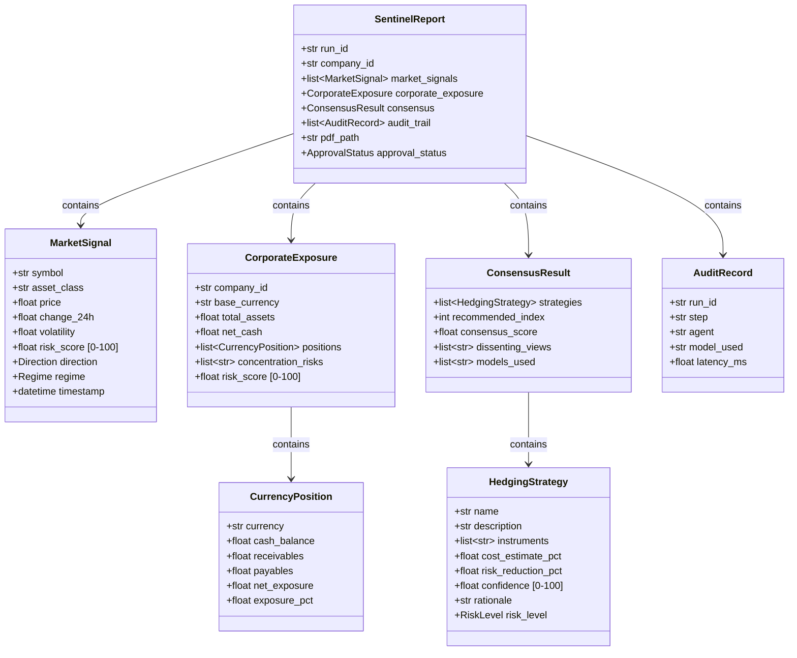

---

## Airia Bridge — Dual Execution Mode

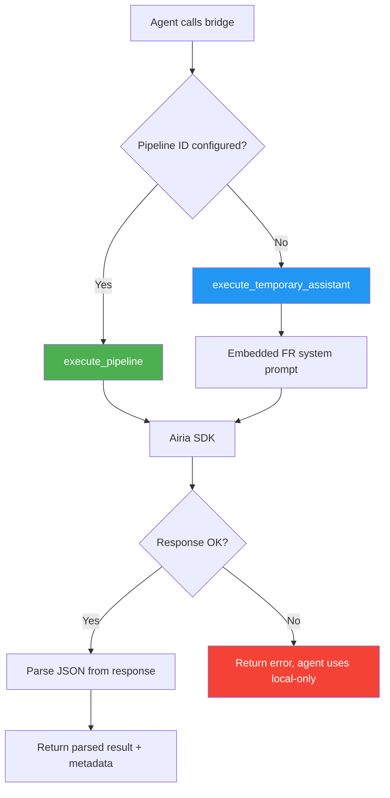

Each agent has a **French system prompt** embedded in `airia_bridge.py`:

| Agent | Prompt Focus | Output Format |
|-------|-------------|---------------|
| Sentinel-1 | Risk scoring, regime detection | JSON: `{signals: [...]}` |
| Sentinel-2 | Exposure analysis, concentration risks | JSON: `{net_exposure, risk_zones}` |
| Sentinel-3 | 3 hedging strategies with rationale | JSON: `{strategies: [...]}` |
| Sentinel-4 | Formal executive summary (Big Four style) | Structured text with sections |

---

## Consensus Algorithm

The 3-way consensus in Agent 3 works as follows:

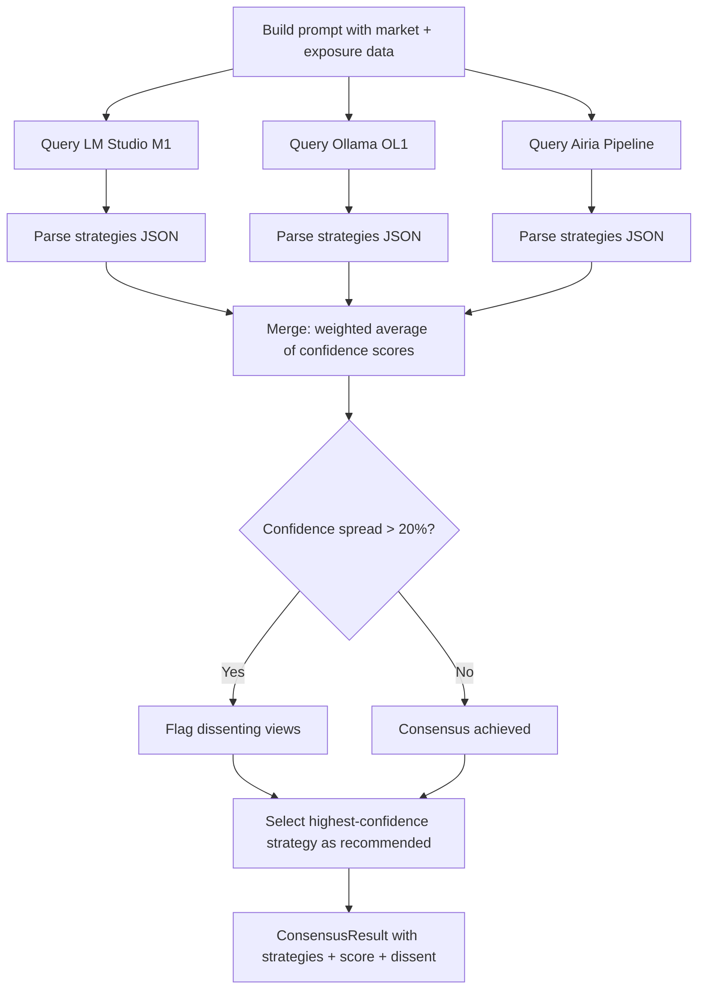

**Merge rules:**
1. Use first complete strategy set as base
2. Average confidence scores across all sources
3. Detect dissenting views when confidence spread exceeds 20%
4. Recommend strategy with highest average confidence

---

## Database Schema

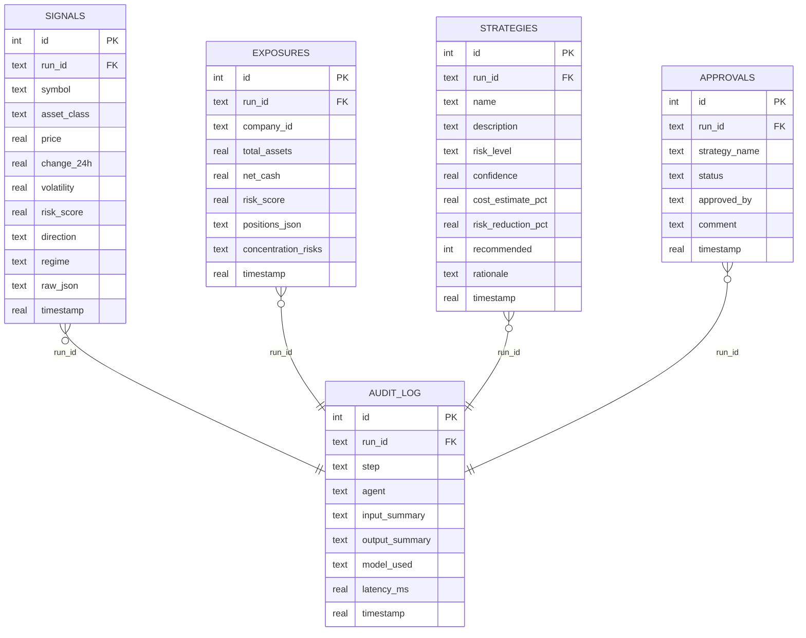

---

## Infrastructure

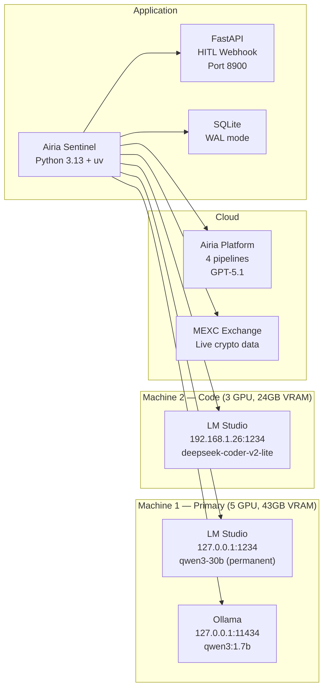

> **Important**: Always use `127.0.0.1` instead of `localhost` to avoid IPv6 DNS resolution latency (~10s) on Windows.

---

## HTTP Connection Management

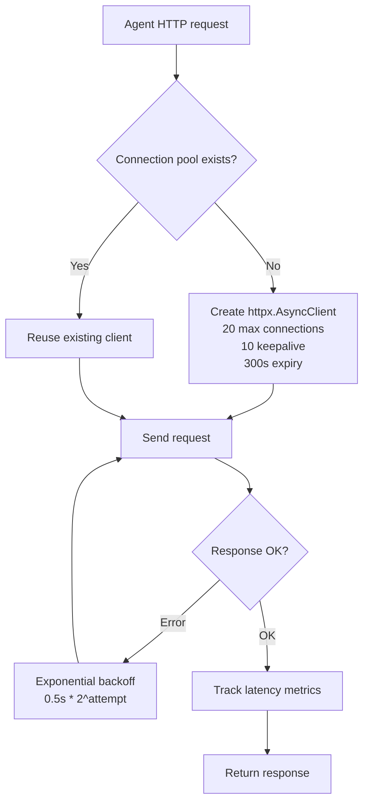

---

## Pipeline Engine — Composable Orchestration Patterns

The Pipeline Engine (`src/pipeline_engine.py`) provides 3 composable patterns:

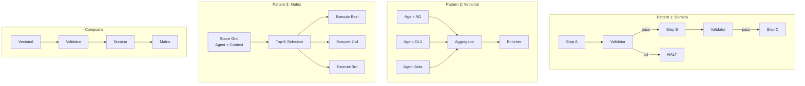

### Pipeline Engine Classes

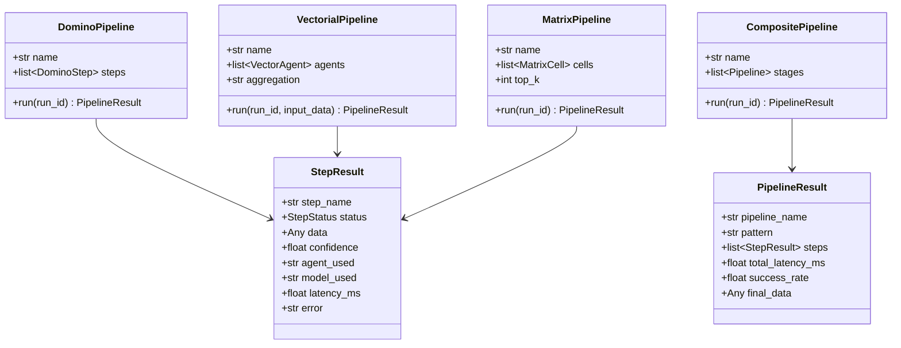

### Matrix Agents

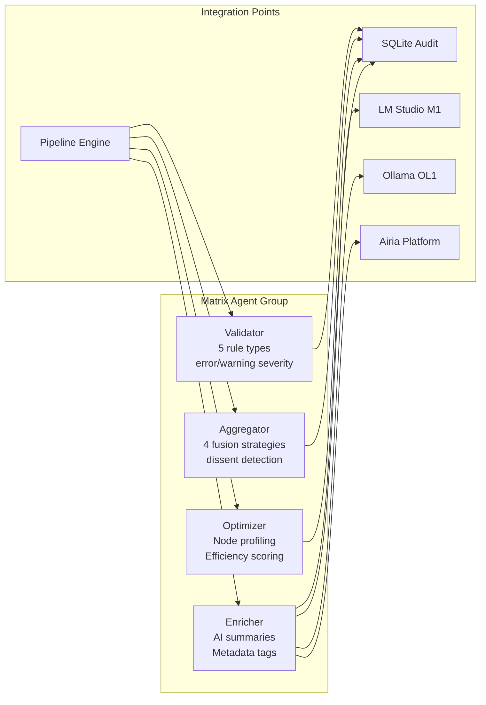

---

*See the main [README.md](../README.md) for quick start instructions and [USE_CASES.md](USE_CASES.md) for domain-specific applications.*
